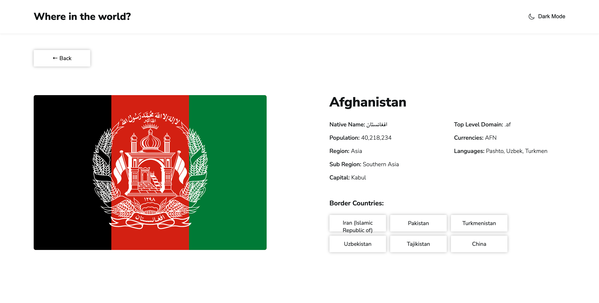

# Frontend Mentor - REST Countries API with color theme switcher solution

This is a solution to the [REST Countries API with color theme switcher challenge on Frontend Mentor](https://www.frontendmentor.io/challenges/rest-countries-api-with-color-theme-switcher-5cacc469fec04111f7b848ca). Frontend Mentor challenges help you improve your coding skills by building realistic projects.

## Table of contents

- [Overview](#overview)
  - [The challenge](#the-challenge)
  - [Screenshot](#screenshot)
  - [Links](#links)
- [My process](#my-process)
  - [Built with](#built-with)
  - [What I learned](#what-i-learned)
  - [Continued development](#continued-development)
  - [Useful resources](#useful-resources)
- [Author](#author)
- [Acknowledgments](#acknowledgments)

**Note: Delete this note and update the table of contents based on what sections you keep.**

## Overview

### The challenge

Users should be able to:

- See all countries from the API on the homepage
- Search for a country using an `input` field
- Filter countries by region
- Click on a country to see more detailed information on a separate page
- Click through to the border countries on the detail page
- Toggle the color scheme between light and dark mode _(optional)_

### Screenshot




### Links

- Solution URL: [Github](https://github.com/delroscol98/REST-Countries)
- Live Site URL: [Netlify](https://main--monumental-crumble-370ea2.netlify.app/)

## My process

### Built with

- Semantic HTML5 markup
- CSS custom properties
- Flexbox
- CSS Grid
- Mobile-first workflow
- [React](https://reactjs.org/) - JS library

### What I learned

This project really pushed the bounds of my knowledge about React and React Router, which ultimately led two bugs which I was unable to solve:

1. 404 status: When the user navigates to a country's page all is well, but when the user refreshes the page a status 404 appears. Hopefully I can solve it soon.
2. Persisting dark mode through screen refreshes: I tried using localStorage to update darkTheme state but was unable to figure it out.

Below is the darkTheme context.

```js
import { useState, createContext } from "react";

const ThemeContext = createContext();

const ThemeProvider = ({ children }) => {
  const [isDarkTheme, setIsDarkTheme] = useState(false);

  const handleDarkTheme = () => {
    setIsDarkTheme(() => !isDarkTheme);
  };

  return (
    <ThemeContext.Provider value={{ isDarkTheme, handleDarkTheme }}>
      {children}
    </ThemeContext.Provider>
  );
};

export { ThemeProvider, ThemeContext };
```

### Continued development

I am still learning the ins-and-outs of React and React Router, I still have a lot to learn. For this project I would like to fix the bugs stated above when I understand React Router more.

## Author

- Frontend Mentor - [@delroscol98](https://www.frontendmentor.io/profile/delroscol98)
